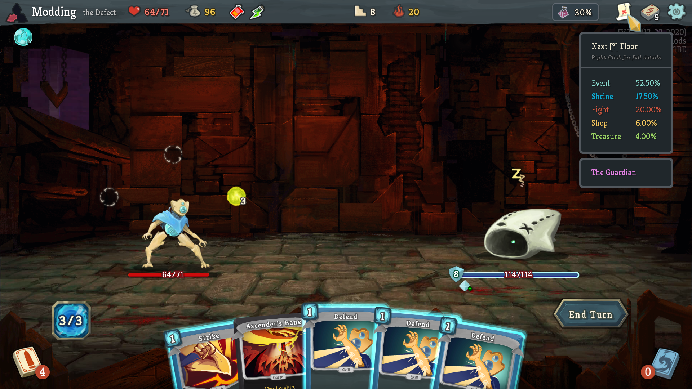
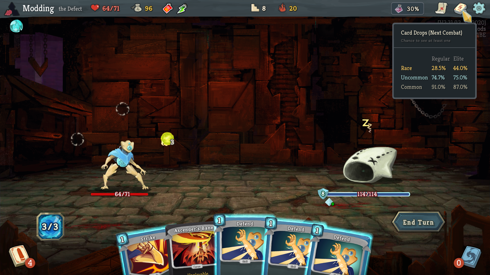

# infomod2
This is a full rewrite and updated version of the original InfoMod project - with upgraded visuals, improved performance optimizations, and a solid foundation to build future ideas.

This project is in early alpha, though it already includes most features that were in the original InfoMod.

### Potion Chance Tracking

Easily keep track of your current potion drop chances. At the start of each act, this value resets to 40%. If you see a potion, the chance goes down by 10%. If you don't see a potion, the chance goes up by 10%. This indicator on the top bar will keep track of this (relatively easy math) for you. Mousing over it will show the chance to see at least one potion after multiple fights!

### Question Mark Floors / Boss Indicator

The Map tooltip has been replaced with two modules - one to let you know what to expect on your next mystery floor, and a second one for quickly identifying the upcoming boss (no more scrolling to the top of the map!). Additional explanations on the calculations performed to get these probabilities can be found on the very useful [Reference Spreadsheet](https://docs.google.com/spreadsheets/d/1ZsxNXebbELpcCi8N7FVOTNGdX_K9-BRC_LMgx4TORo4).

You can right click this map icon to open up a screen showing all the possible events for the upcoming floors. This screen is WIP and not yet working fully - but I want to get it finished before the first release onto the workshop!

### Card Drop Chances

The deck tool tip has been replaced with a visual way to see how likely you are to see a card of a certain rarity in the next combat reward screen. This is a reasonably complicated calculation, but the general gist is that the more common cards you see -> the more likely you are to see a rare card. A decent ballpark estimate is that each common card you see will increase your chance to see a rare by 1% - although hitting a rare card will reset the chance to 0% again. 

Elite combat rewards are more likely to have a rare card than normal combats - and there are some other wrinkles in the computation (e.g. hidden card rewards for some Neow rewards) that make the calculation a bit more involved. Some additional information can be found on the [Reference Spreadsheet](https://docs.google.com/spreadsheets/d/1ZsxNXebbELpcCi8N7FVOTNGdX_K9-BRC_LMgx4TORo4), but it isn't quite 100% accurate due to some semantics in the mathematics.

### Notes

* This is not a cheat mod! Using this mod doesn't give you any practical advantage in optimal play - none of the data displayed is unable to be calculated manually without the mod. It's just tedious to do in normal games!
* This mod is under construction - expect bugs!
* I haven't done any testing for non standard resolutions yet - so right now it works at 1080p, but will likely break if you don't have that particular resolution. I plan on doing a bit more testing and tweaking to make it work for nonstandard resolutions before the workshop release.

### Installation

Requires ModTheSpire and BaseMod (you can find them on the Steam workshop!). Currently, I'm holding off onto releasing into the wilds of the workshop until I finish up a few more planned screens and do a bit more testing / polishing to make sure everything works.

To install:

* Remove any previous version of InfoMod from your SlayTheSpire/mods folder (you can delete InfoMod.jar as it is incompatible with this mod)
* Head over to the [releases page](https://github.com/casey-c/infomod2/releases) and download the latest InfoMod2.jar file. Place it into your SlayTheSpire/mods directory. 
* Launch the game with mods and make sure to check the box to enable InfoMod and the required BaseMod library.
  
*NOTE: You may want to start a fresh game save first - as the boss indicator won't update correctly*
