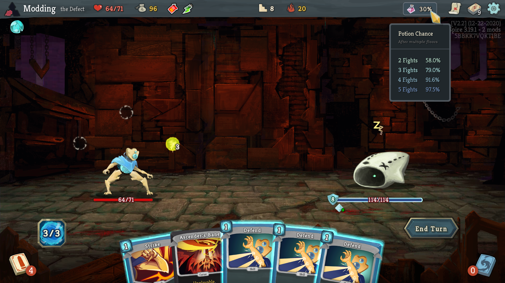

# infomod2
This is a full rewrite and updated version of the original InfoMod project - with upgraded visuals, improved performance optimizations, and a more solid foundation to build future ideas.

This project is in early alpha and is not yet available on the Steam Workshop. However, it already includes most features that were in the [original InfoMod](https://github.com/casey-c/spiretool-infomod) and is stable enough to replace it by now. You can scroll down to the installation section of this README page to learn how to install this mod, or head over to my [Slay the Spire mod website](https://casey-c.github.io/slaythespire) for a curated collection of all my mods (including more indepth installation instructions and tutorials!).

This mod is intended to be installed alongside [Bestiary](https://github.com/casey-c/bestiary) (a mod to display enemy AI patterns and movesets) as it originated inside the original InfoMod before being spliced off into its own standalone mod. Be sure to check that out as well for the full experience if you haven't yet!

## Features

### Potion Chance Tracking

Easily keep track of your current potion drop chances. At the start of each act, this value resets to 40%. If you see a potion, the chance goes down by 10%. If you don't see a potion, the chance goes up by 10%. This indicator on the top bar will keep track of this (relatively easy math) for you. Mousing over it will show the chance to see at least one potion after multiple fights!



### Question Mark Floors / Boss Indicator

The Map tooltip has been replaced with two modules - one to let you know what to expect on your next mystery floor, and a second one for quickly identifying the upcoming boss (no more scrolling to the top of the map!). Additional explanations on the calculations performed to get these probabilities can be found on the very useful [Reference Spreadsheet](https://docs.google.com/spreadsheets/d/1ZsxNXebbELpcCi8N7FVOTNGdX_K9-BRC_LMgx4TORo4).


Right clicking the map icon will bring up an event overview screen. This screen will show which events you can see on the very next floor and updates the colors based on whether you satisfy the event's requirements. You can use this overview to quickly understand which events are possible, and check that you correctly fulfill all the necessary prerequisites (e.g. minimum gold requirements, having certain relics, etc.).

Each of the events has a full description of the possible choices and effects of those choices, as well as listing out further details that may be of interest. Events that you encounter previously in the run will be marked "inactive" (shown in a bluish gray color) and have their tooltips updated to display which floor you saw them on.


### Card Drop Chances

The deck tool tip has been replaced with a visual way to see how likely you are to see a card of a certain rarity in the next combat reward screen. This is a reasonably complicated calculation, but the general gist is that the more common cards you see -> the more likely you are to see a rare card. A decent ballpark estimate is that each common card you see will increase your chance to see a rare by 1% - although hitting a rare card will reset the chance to 0% again. 

Elite combat rewards are more likely to have a rare card than normal combats - and there are some other wrinkles in the computation (e.g. hidden card rewards for some Neow rewards) that make the calculation a bit more involved. Some additional information can be found on the [Reference Spreadsheet](https://docs.google.com/spreadsheets/d/1ZsxNXebbELpcCi8N7FVOTNGdX_K9-BRC_LMgx4TORo4), but it isn't quite 100% accurate due to some semantics in the mathematics.


### Shop Prices

The Gold tool tip has been improved to show the prices you can expect in the next shop. The values are color coded to easily tell whether you can afford a certain rarity of item with your current amount of gold. These prices and colors will properly adjust with your current relics and whenever you gain / lose gold. There's also a card removal price tracker as well!


## Installation

A more in depth explanation of installing Slay the Spire mods from Github can be found on my [Slay the Spire website](https://casey-c.github.io/slaythespire), if you run into any issues!

Requires ModTheSpire and BaseMod (you can find them on the Steam workshop!). Currently, I'm holding off onto releasing into the wilds of the workshop until I finish up a few more planned screens and do a bit more testing / polishing to make sure everything works.

To install:

* Remove any previous version of InfoMod from your SlayTheSpire/mods folder (you can delete InfoMod.jar as it is incompatible with this mod)
* Head over to the [releases page](https://github.com/casey-c/infomod2/releases) and download the latest InfoMod2.jar file. Place it into your SlayTheSpire/mods directory. You should create this folder if it doesn't exist! 

 *NOTE: this is not the same location as Steam workshop managed mods - for this mod, you'll want to install directly inside the SlayTheSpire directory (putting it somewhere like ```.../steam/steamapps/common/SlayTheSpire/mods/InfoMod2.jar```)*
* Launch the game with mods and make sure to check the box to enable InfoMod and the required BaseMod library.
  

### Notes

* You may want to start a fresh game save first - as the boss indicator won't update correctly
* This is not a cheat mod! Using this mod doesn't give you any practical advantage in optimal play - none of the data displayed is unable to be calculated manually without the mod. It's just tedious to do in normal games!
* This mod is under construction - expect bugs!
* This mod is designed for 1080p (1920x1080) resolution first, but a decent amount of effort was put in to make it compatible with alternate resolutions (including ultrawide). It should work, but it'll be a bit less pretty. As I don't have anything other than a 1080p screen personally, please let me know if anything looks too wonky or unreadable over on the [Issues Page](https://github.com/casey-c/infomod2/issues) here on Github.

### Feedback

Please [drop me a line on the issues page](https://github.com/casey-c/infomod2/issues) if you have ideas, suggestions, find bugs, or have any other comments. Thank you!
